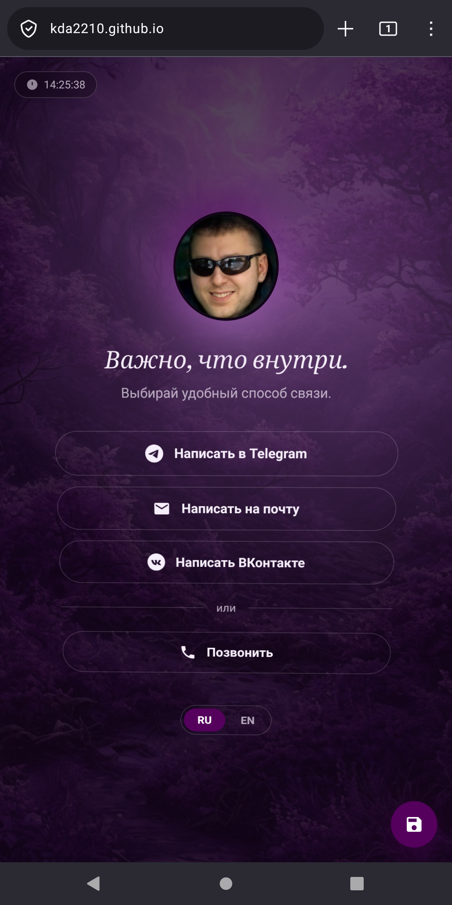
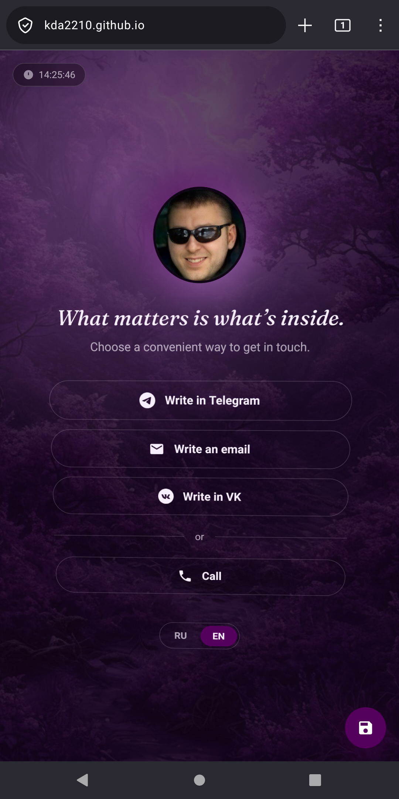

<p align="right"><a href="#en-top"><b>🇬🇧 English</b></a> · <a href="#ru-top">🇷🇺 Русский</a></p>

# 🪪 kda2210.github.io

<p align="center">
  <a href="#en-top"><b>🇬🇧 English</b></a> · <a href="#ru-top">🇷🇺 Русский</a>
</p>

---

<a name="en-top"></a>
# 🇬🇧 English

*A personal digital business card — one HTML file, more craft than that usually implies.*

<p align="center">
<a href="#en-about">📖 About</a> ·
<a href="#en-try">🔗 Try it</a> ·
<a href="#en-features">✨ Features</a> ·
<a href="#en-license">📄 License</a> ·
<a href="#en-support"></a> ·
<a href="https://github.com/kda2210/kda2210.github.io/issues">🐛 Issues</a> ·
<a href="#ru-top">🇷🇺 RU</a>
</p>

<details>
<summary>📑 Table of contents</summary>

- [About](#en-about)
- [Screenshots](#en-screenshots)
- [Try it](#en-try)
- [Features](#en-features)
- [Built with](#en-built-with)
- [Want to build your own?](#en-fork)
- [Security](#en-security)
- [FAQ](#en-faq)
- [License](#en-license)
- [Support](#en-support)
- 🐛 [Report an issue](https://github.com/kda2210/kda2210.github.io/issues) ↗

</details>

**Most personal landing pages reach for a framework, a build step, and a handful of dependencies before they've said a single word about the person behind them.**

kda2210.github.io simply asks one question:

> **"How much care can fit into one HTML file?"**

See for yourself: **[kda2210.github.io](https://kda2210.github.io)**

---

**Free. No ads. No subscriptions. Works offline. Open Source.**

These aren't marketing slogans.

They're the principles behind every project I build.

If you're curious why I deliberately choose this approach, this page explains both the site and the philosophy behind it.

[](https://opensource.org/licenses/MIT)
[](https://github.com/kda2210)
[](#en-support)
[](https://kda2210.github.io)


---

## 🌿 Why these principles matter

I believe useful software should remain accessible to everyone. That's why every application I build follows the same handful of principles, no matter what the app itself does.

|  | Principle | In short |
|:---:|---|---|
| 💸 | **Free** | You never pay to use it. |
| 🚫 | **No ads** | Nothing competes for your attention. |
| 🔁 | **No subscriptions** | Install once, use it for as long as you like. |
| 📴 | **Works offline** | No server — nothing leaves your device. |
| 🔓 | **Open Source** | Nothing hidden. Read it, verify it, build on it. |

<details>
<summary><b>Read the full reasoning behind each principle</b></summary>

### ✔️ Free

You never have to pay to use my apps. Useful tools should be available regardless of someone's financial situation.

### ✔️ No ads

Advertisements distract, break concentration, and make software less pleasant to use. I believe an application should solve a problem — not compete for your attention.

### ✔️ No subscriptions

Subscriptions have become the default business model for almost everything. For small personal tools, I believe people should be able to install an app once and simply use it, without adding another monthly payment to their lives.

### ✔️ Works offline

That's why my applications are designed so all core features work completely offline: no server dependency, faster performance, better privacy, use the app anywhere.

### ✔️ Open Source from day one

Every project is open source from day one, so you can see exactly how it works, verify there are no hidden mechanisms, learn from the code, contribute, and know the project can keep existing long after I stop maintaining it.

</details>

<p align="right">(<a href="#en-top">⬆ back to top</a>)</p>

---

<a name="en-about"></a>
## 📖 About

kda2210.github.io is my personal digital business card: an avatar, a short line about me, and ways to reach me. It's a single static HTML file — no build step, no dependencies — but with more attention to detail than that description usually implies: an ambient light that follows your cursor or finger and slowly drifts on its own when you're not touching anything, a card that responds when you tilt your phone, and a few smaller touches most one-file pages skip entirely.

It isn't trying to be a template or a starter kit — it's simply the page I use for myself, published because there was no reason to keep it closed.

---

<a name="en-screenshots"></a>
## 🎬 Screenshots

<!--
  A short GIF or screen recording will show this better than a static
  image — the ambient light, the gyroscope parallax, and the vCard
  flow are all motion, not layout. e.g.:

  <p align="center">
    
  </p>
-->

*Coming soon — best shown as a short clip rather than a still image, given the motion involved.*

---

<a name="en-try"></a>
## 🔗 Try it

Live: **[kda2210.github.io](https://kda2210.github.io)**

Or run it locally — clone the repo and open `index.html` in a browser. Nothing to install, nothing to build.

---

<a name="en-features"></a>
## ✨ Features

### 🌍 RU / EN

A language switch that remembers your choice between visits.

---

### 💡 Ambient light

A soft light follows your cursor or finger; when you're not moving it, it drifts slowly on its own.

---

### 📱 Gyroscope on mobile

Tilt your phone and the background, the light, and the card itself all respond — a small parallax effect, in the smallest amount of code that could produce it.

---

### 📇 Save contact

Generates a vCard right in the browser, no server involved.

---

### 🕐 Live clock

Shows the owner's local time, always current.

---

### ♿ Respects `prefers-reduced-motion`

Every animation switches off cleanly for anyone who'd rather not see them.

---

### 👀 A hidden easter egg

Not telling. Find it yourself.

---

### 🪶 Zero dependencies

Plain HTML, CSS, and JavaScript in a single file — nothing to install, build, or keep updated.

<p align="right">(<a href="#en-top">⬆ back to top</a>)</p>

---

<a name="en-built-with"></a>
## 🛠️ Built with

Vanilla HTML, CSS, and JavaScript — no frameworks, no build tools. A few browser platform APIs used directly: the Web Audio API (sound), the Device Orientation API (gyroscope), and CSS custom properties with `@keyframes` for the animations.

```
index.html          — the entire page
fioletovyj.jpeg      — background image
LICENSE               — MIT license (code only, see below)
```

---

<a name="en-fork"></a>
## 🍴 Want to build your own?

The code is open — fork it and make it yours. The main things worth changing:

- the Telegram / email / VK / phone links
- the avatar and background image
- the timezone, in the `TIMEZONE` variable
- the details in the vCard generator
- the tagline and the text underneath it

---

<a name="en-security"></a>
## 🔐 Security

Found something that looks like an actual security issue — not just "you could minify this CSS"? See [SECURITY.md](https://github.com/kda2210/kda2210.github.io/blob/main/SECURITY.md) rather than opening a public issue.

---

<a name="en-faq"></a>
## ❓ FAQ

<details>
<summary><b>Why not React / a static site generator / some build tool?</b></summary>
<br>

A landing page someone looks at for five seconds doesn't need a build pipeline. One file is easier to read, easier to trust, and easier to fork.

</details>

<details>
<summary><b>Can I use your photo or contact details if I fork this?</b></summary>
<br>

No — see the note in [License](#en-license). Swap them for your own; that's the whole point of forking it.

</details>

<details>
<summary><b>Does it track or analyze visitors?</b></summary>
<br>

No analytics, no cookies, no tracking of any kind. It's a static file — nobody's watching who opens it.

</details>

<details>
<summary><b>What's the easter egg?</b></summary>
<br>

👀

</details>

<p align="right">(<a href="#en-top">⬆ back to top</a>)</p>

---

<a name="en-license"></a>
## 📄 License

Released under the MIT License — for the code.

Use it. Study it. Fork it. Build your own version.

**One exception:** the personal content in this repository — the photo, phone number, email, and social links — isn't covered by that license. That's not code, it's one specific person's contact information, and there's no reason for anyone but me to reuse it. If you fork this, swap it all out for your own — see [Want to build your own?](#en-fork).

---

## ❤️ Why I keep building

Creating applications like this takes a great deal of time. I keep doing it because I genuinely enjoy building tools that make everyday life a little better.

If my projects help people, voluntary support lets me spend more time improving existing apps and building new ones.

> [!NOTE]
> Support is entirely optional. It doesn't unlock any features, and it changes nothing about how the apps work — it's simply a way of saying **"thank you." ❤️**

If even one of my applications has been useful to you, then all the hours spent building it were worth it. Thank you for using my projects.

---

<a name="en-support"></a>
## ❤️ Voluntary Support

If you'd like to support the development of current and future projects, pick whatever's easiest for you.

<details>
<summary><b>💳 Show all ways to support</b></summary>

<br>

**Crypto**

₮ USDT (TRC20)
```text
TJXTxpVagstdhLoZqigZsvyP2CLRzwdgiF
```

₿ Bitcoin
```text
bc1q4p4zesf49zsufnwj3c3ux77fcxzslha4djukwp
```

◈ ETH (ERC20) / USDC (Base) / BNB (BEP20)
```text
0x997250d092b4c2DF645BaA9CA512891f7C3DD351
```

☀️ SOL (Solana)
```text
KidCphzsH8FwNqirSKidVJUEE8ehN8g2WQtNBmuMhPi
```

💎 TON
```text
UQBHfMPQ2zQWno06shSoYWTxZHVl6zGPctfqBnsRQf4r0U4X
```

✕ XRP (Ripple)
```text
r3e3iyezjaGAsB64aNEfGDgrPYmachHZyc
```

★ XLM (Stellar)
```text
GBVZ3TMMJLWJ7RUCM2X6QQZADWHFLHEGDDVOT3TPLVLJFQOCEGVLUCU4
```

**Prefer another method?**

✉️ kda2210@duck.com

</details>

<p align="right">(<a href="#en-top">⬆ back to top</a>)</p>

---

## 🌱 Thank you

Thank you for reading this far.

Whether or not you decide to support these projects, I'm sincerely grateful to everyone who uses them. You're the reason they continue to grow. ❤️

<p align="right"><a href="#ru-top">🇷🇺 Читать на русском ↓</a></p>

---

<a name="ru-top"></a>
# 🇷🇺 Русский

*Личная цифровая визитка — один HTML-файл и куда больше внимания к деталям, чем можно ожидать.*

<p align="center">
<a href="#ru-about">📖 О проекте</a> ·
<a href="#ru-try">🔗 Посмотреть</a> ·
<a href="#ru-features">✨ Функции</a> ·
<a href="#ru-license">📄 Лицензия</a> ·
<a href="#ru-support"></a> ·
<a href="https://github.com/kda2210/kda2210.github.io/issues">🐛 Issues</a> ·
<a href="#en-top">🇬🇧 EN</a>
</p>

<details>
<summary>📑 Содержание</summary>

- [О проекте](#ru-about)
- [Скриншоты](#ru-screenshots)
- [Посмотреть](#ru-try)
- [Функции](#ru-features)
- [Технологии](#ru-built-with)
- [Хочешь сделать себе такую же?](#ru-fork)
- [Безопасность](#ru-security)
- [FAQ](#ru-faq)
- [Лицензия](#ru-license)
- [Поддержка](#ru-support)
- 🐛 [Сообщить об ошибке](https://github.com/kda2210/kda2210.github.io/issues) ↗

</details>

**Большинство личных лендингов первым делом тянут за собой фреймворк, сборку и десяток зависимостей — ещё до того, как скажут хоть слово о человеке за ними.**

kda2210.github.io просто отвечает на один вопрос:

> **«Сколько внимания к деталям поместится в один HTML-файл?»**

Посмотреть можно здесь: **[kda2210.github.io](https://kda2210.github.io)**

---

**Бесплатно. Без рекламы. Без подписок. Работает офлайн. Открытый код.**

Это не рекламные лозунги.

Это принципы, которым я следую в каждом своём проекте.

Если вам интересно, почему я осознанно выбираю именно такой подход — эта страница объясняет и саму страницу, и философию за ней.

[](https://opensource.org/licenses/MIT)
[](https://github.com/kda2210)
[](#ru-support)
[](https://kda2210.github.io)


---

## 🌿 Почему эти принципы важны

Я считаю, что полезные программы должны оставаться доступными каждому. Поэтому все мои приложения следуют одним и тем же принципам — независимо от того, что делает конкретная программа.

|  | Принцип | Коротко |
|:---:|---|---|
| 💸 | **Бесплатно** | Вы никогда не платите за использование. |
| 🚫 | **Без рекламы** | Ничто не отвлекает и не борется за ваше внимание. |
| 🔁 | **Без подписок** | Установили один раз — пользуетесь сколько угодно. |
| 📴 | **Работает офлайн** | Ни одного сервера — ничего не покидает устройство. |
| 🔓 | **Открытый код** | Ничего не скрыто. Читайте, проверяйте, дорабатывайте. |

<details>
<summary><b>Подробнее о каждом принципе</b></summary>

### ✔️ Бесплатно

Вам никогда не придётся платить за использование моих приложений. Полезные инструменты должны быть доступны независимо от финансового положения человека.

### ✔️ Без рекламы

Реклама отвлекает, сбивает концентрацию и делает использование программы менее приятным. Я считаю, что приложение должно решать задачу, а не бороться за ваше внимание.

### ✔️ Без подписок

Для небольших личных инструментов я считаю, что человек должен иметь возможность один раз установить приложение и просто пользоваться им — не добавляя себе ещё один ежемесячный платёж.

### ✔️ Работает офлайн

Поэтому все мои приложения спроектированы так, чтобы все основные функции работали полностью офлайн: никакой зависимости от сервера, выше скорость, больше приватности, можно пользоваться где угодно.

### ✔️ Открытый код с первого дня

Каждый проект открыт с самого начала — вы можете увидеть, как устроено приложение, убедиться, что в нём нет скрытых механизмов, изучать код, вносить улучшения и быть уверены, что проект сможет жить дальше, даже если я перестану его поддерживать.

</details>

<p align="right">(<a href="#ru-top">⬆ наверх</a>)</p>

---

<a name="ru-about"></a>
## 📖 О проекте

kda2210.github.io — моя личная цифровая визитка: аватар, короткая подпись и способы связи. Это один статический HTML-файл — без сборки, без зависимостей — но с куда большим вниманием к деталям, чем обычно подразумевает такое описание: мягкая подсветка следует за курсором или пальцем и медленно дрейфует сама, когда её не трогаешь, карточка реагирует на наклон телефона, и есть ещё несколько мелочей, которые в странице из одного файла обычно просто не делают.

Это не попытка сделать шаблон или стартовый набор — это просто страница, которой я пользуюсь сам, и опубликована она потому, что не было причин держать её закрытой.

---

<a name="ru-screenshots"></a>
## 🎬 Скриншоты

  <p align="center">
    
  </p>


  <p align="center">
    
  </p>
---

<a name="ru-try"></a>
## 🔗 Посмотреть

Онлайн: **[kda2210.github.io](https://kda2210.github.io)**

Или локально — клонируйте репозиторий и откройте `index.html` в браузере. Собирать и устанавливать ничего не нужно.

---

<a name="ru-features"></a>
## ✨ Функции

### 🌍 RU / EN

Переключение языка с запоминанием выбора между визитами.

---

### 💡 Динамическая подсветка

Мягкий свет следует за курсором или пальцем; в покое медленно дрейфует сам.

---

### 📱 Гироскоп на мобильных

При наклоне телефона реагируют фон, подсветка и сама карточка — небольшой параллакс-эффект, реализованный минимальным количеством кода.

---

### 📇 Сохранить контакт

Генерация vCard прямо в браузере, без сервера.

---

### 🕐 Живые часы

Показывают местное время владельца, всегда актуальное.

---

### ♿ Полная поддержка `prefers-reduced-motion`

Все анимации корректно отключаются для тех, кто не хочет их видеть.

---

### 👀 Скрытая пасхалка

Не скажу. Найдите сами.

---

### 🪶 Ноль зависимостей

Чистые HTML, CSS и JavaScript в одном файле — ничего не нужно устанавливать, собирать или обновлять.

<p align="right">(<a href="#ru-top">⬆ наверх</a>)</p>

---

<a name="ru-built-with"></a>
## 🛠️ Технологии

Vanilla HTML, CSS и JavaScript — без фреймворков и сборщиков. Из платформенных API используются напрямую: Web Audio API (звук), Device Orientation API (гироскоп), CSS custom properties и `@keyframes` для анимаций.

```
index.html          — вся страница целиком
fioletovyj.jpeg      — фоновое изображение
LICENSE               — лицензия MIT (только на код, см. ниже)
```

---

<a name="ru-fork"></a>
## 🍴 Хочешь сделать себе такую же?

Код открыт, можно форкнуть и подстроить под себя. Основное, что стоит поменять:

- ссылки на Telegram / почту / VK / телефон
- аватар и фоновое изображение
- часовой пояс в переменной `TIMEZONE`
- данные в генераторе vCard
- фразу-девиз и текст под ней

---

<a name="ru-security"></a>
## 🔐 Безопасность

Нашли что-то похожее на настоящую проблему безопасности — не просто «можно было бы минифицировать CSS»? См. [SECURITY.md](https://github.com/kda2210/kda2210.github.io/blob/main/SECURITY.md), а не публичный issue.

---

<a name="ru-faq"></a>
## ❓ FAQ

<details>
<summary><b>Почему не React / генератор статики / хоть какая-то сборка?</b></summary>
<br>

Лендинг, на который смотрят пять секунд, не нуждается в сборочном пайплайне. Один файл проще прочитать, проще проверить и проще форкнуть.

</details>

<details>
<summary><b>Можно использовать твоё фото или контакты, если я форкну репозиторий?</b></summary>
<br>

Нет — см. примечание в разделе [Лицензия](#ru-license). Замените на свои — в этом весь смысл форка.

</details>

<details>
<summary><b>Есть отслеживание или аналитика посетителей?</b></summary>
<br>

Никакой аналитики, куки или трекинга. Это статичный файл — никто не следит, кто его открывает.

</details>

<details>
<summary><b>Что за пасхалка?</b></summary>
<br>

👀

</details>

<p align="right">(<a href="#ru-top">⬆ наверх</a>)</p>

---

<a name="ru-license"></a>
## 📄 Лицензия

Код распространяется под лицензией MIT.

Используйте. Изучайте. Форкайте. Делайте свою версию.

**Одно исключение:** личные данные в этом репозитории — фото, номер телефона, почта, ссылки на соцсети — этой лицензией не покрываются. Это не код, а контактные данные конкретного человека, и смысла переиспользовать их кому-то, кроме меня, нет. Если форкаете — замените всё на своё, см. [«Хочешь сделать себе такую же?»](#ru-fork).

---

## ❤️ Почему я продолжаю это делать

Разработка таких приложений отнимает очень много времени. Я продолжаю этим заниматься, потому что мне искренне нравится создавать инструменты, которые делают повседневную жизнь немного лучше.

Если мои проекты кому-то помогают, добровольная поддержка позволяет мне уделять больше времени доработке существующих приложений и созданию новых.

> [!NOTE]
> Поддержка полностью добровольна. Она не открывает никаких дополнительных функций и никак не меняет работу приложений — это просто способ сказать **«спасибо». ❤️**

Если хотя бы одно из моих приложений оказалось вам полезным — значит, все часы, потраченные на его создание, того стоили. Спасибо, что пользуетесь моими проектами.

---

<a name="ru-support"></a>
## ❤️ Добровольная поддержка

Если хотите поддержать разработку текущих и будущих проектов — выберите любой удобный для вас способ.

<details>
<summary><b>💳 Показать все способы поддержки</b></summary>

<br>

**Оплата картой (Россия)**

<p align="left">
<a href="https://pay.cloudtips.ru/p/89752366"></a>
</p>

**Криптовалюта**

₮ USDT (TRC20)
```text
TJXTxpVagstdhLoZqigZsvyP2CLRzwdgiF
```

₿ Bitcoin
```text
bc1q4p4zesf49zsufnwj3c3ux77fcxzslha4djukwp
```

◈ ETH (ERC20) / USDC (Base) / BNB (BEP20)
```text
0x997250d092b4c2DF645BaA9CA512891f7C3DD351
```

☀️ SOL (Solana)
```text
KidCphzsH8FwNqirSKidVJUEE8ehN8g2WQtNBmuMhPi
```

💎 TON
```text
UQBHfMPQ2zQWno06shSoYWTxZHVl6zGPctfqBnsRQf4r0U4X
```

✕ XRP (Ripple)
```text
r3e3iyezjaGAsB64aNEfGDgrPYmachHZyc
```

★ XLM (Stellar)
```text
GBVZ3TMMJLWJ7RUCM2X6QQZADWHFLHEGDDVOT3TPLVLJFQOCEGVLUCU4
```

**Другой способ?**

✉️ kda2210@duck.com

</details>

<p align="right">(<a href="#ru-top">⬆ наверх</a>)</p>

---

## 🌱 Спасибо

Спасибо, что дочитали до конца.

Независимо от того, решите вы поддержать проекты или нет, я искренне благодарен каждому, кто ими пользуется. Именно вы — причина, по которой они продолжают развиваться. ❤️

<p align="right"><a href="#en-top">🇬🇧 Read in English ↑</a></p>
